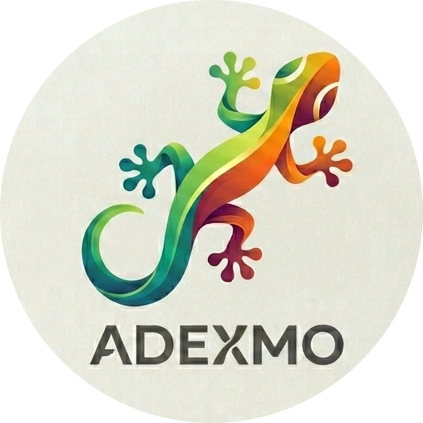
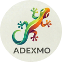
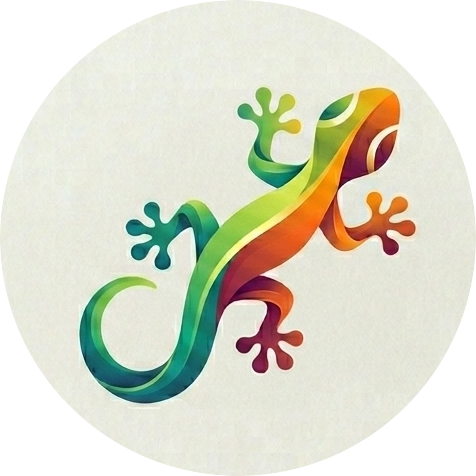

# Adexmo Brand Guidelines

This document defines the visual identity for the **Adexmo** project. Following these guidelines ensures the brand is represented consistently across all documentation, websites, and promotional materials.

---

## 1. The Brand
Adexmo is a software development analysis model. The brand is designed to convey agility, precision, and adaptability.

### Logotype (Extended Logo)
The extended logo consists of the "ADEXMO" wordmark with a stylized "X" representing the interconnection of data and processes.
* **Primary Use:** Repository headers, websites, and presentations.
* **Reference Files:** `logo-full.svg`, `logo-full-lg.png`.

### Icon (The Gecko)
The gecko icon represents the model's ability to "grip" the reality of software development and maintain a 360-degree vision.
* **Symbolism:** Agility, data adherence, and perspective.
* **Primary Use:** Favicons, social media avatars, and system icons.
* **Reference Files:** `gecko-only.png`.

### List of all image files
| Filename                    | Resolution    | Target                                        |
|-----------------------------|---------------|-----------------------------------------------|
| logo-full.svg               | Malleable     | Vectorial extended logo                       |
| logo-full-sm.png            | 300x80 px     | Extended logo in PNG tiny                     |
| logo-full-md.png            | 600x160 px    | Extended logo in PNG medium                   |
| logo-full-lg.png            | 1200x320 px   | Extended logo in PNG big                      |
| logo-with-text.png          | 525x525 px    | Icon in PNG with writing (Hi-Res)             |
| logo-with-text-128.png      | 128x128 px    | Icon in PNG with writing in 128x128           |
| favicon-text-32.ico         | 32x32 px      | Icon in ICO with writing in 32x32             |
| gecko-only.png              | 476x476 px    | Icon in PNG w/o writing (Hi-Res)              |
| gecko-only-32.png           | 32x32 px      | Icon in PNG w/o writing in 32x32              |
| gecko-only-64.png           | 64x64 px      | Icon in PNG w/o writing in 64x64              |
| gecko-only-128.png          | 128x128 px    | Icon in PNG w/o writing in 128x128            |
| favicon-gecko-32.ico        | 32x32 px      | Icon in ICO w/o writing in 32x32              |
| favicon-gecko-64.ico        | 64x64 px      | Icon in ICO w/o writing in 64x64              |
| favicon-gecko-128.ico       | 128x128 px    | Icon in ICO w/o writing in 128x128            |

### Previews

 
 

 

---

## 2. Standard Colors
The Adexmo identity uses a vibrant palette to stand out in the tech landscape.

| Color | Preview | HEX | Usage |
| :--- | :--- | :--- | :--- |
| **Deep Teal** |  | `#008080` | Wordmark base and gecko body start |
| **Vibrant Green** |  | `#32CD32` | Gecko mid-section (Energy) |
| **Electric Orange** |  | `#FF8C00` | Upper gradients (Agility) |
| **Deep Purple** |  | `#4B0082` | Tail and accents (Stability) |
| **Carbon** |  | `#333333` | Monochromatic text / Dark Mode |

---

## 3. Typography
While the logo is a custom graphic, the following fonts are recommended for visual consistency in related documents:

* **Primary Font:** `Montserrat` (Bold/Semi-Bold) - To be used for titles and headers.
* **Secondary Font:** `Roboto` or `Inter` - To be used for body text and technical documentation.
* **Code:** `Fira Code` or `JetBrains Mono` - For code blocks within the Adexmo model.

---

## 4. Brand Assets
All graphic assets are stored in the `/assets` folder of the repository.

### Asset Quick List
For a full list, see `ASSETS_LIST.md`:
* `logo-full.svg`: Malleable vectorial version.
* `logo-full-md.png`: Standard version for documents.
* `gecko-only-64.png`: Browser icon version.

---

## 5. Usage Rules
* **Clear Space:** Always maintain a "safe area" around the logo equal to the height of the letter "A".
* **Backgrounds:** On dark backgrounds, use the white-text version of the logo or the SVG file with `fill="currentColor"`.
* **Prohibitions:**
  * Do not distort or stretch the logo.
  * Do not change the gecko's gradients.
  * Do not use the gecko icon without the wordmark in official repository branding contexts.

---

## 6. License
Adexmo logos and graphic assets are licensed under [Creative Commons BY-NC-SA 4.0](https://creativecommons.org/licenses/by-nc-sa/4.0/). The model's source code follows the project's primary license (e.g., MIT).