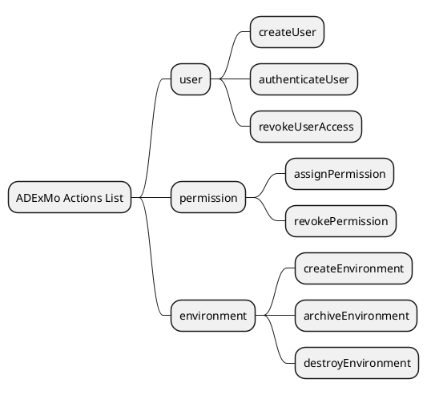
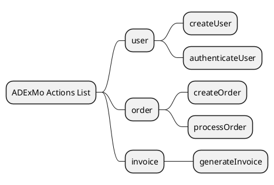

# ADExMo Actions List

## Purpose

The ADExMo Actions List is the official contract of application behavior.

It defines what the application can do through a structured catalog of executable actions, organized by domains.

The Actions List is not an implementation document.
It is not an API specification.
It is not a UI specification.

It is the behavioral contract of the system.

---

## Core Principle

> The ADExMo Actions List defines application behavior through executable actions.

Each action represents a real use case of the system and can be invoked by different interfaces, such as:

- HTTP controllers
- CLI commands
- queue jobs
- test runners
- integration adapters

Interfaces do not own the business logic.
They only invoke actions.

---

## Role of the Actions List

The Actions List acts as:

1. a contract between analysis and implementation
2. a reference for backend developers
3. a reference for API and UI teams
4. a validation artifact for business behavior
5. a versioned catalog of executable capabilities

Its main goal is to reduce ambiguity between what was analyzed, what is implemented, and what is exposed through interfaces.

---

## Structural Overview

A visual overview can be used to represent the structure of the Actions List.

This overview may be expressed as a MindMap diagram.

The MindMap shows:

- the Actions List root
- the domains
- the actions contained in each domain

It does not replace the formal action definitions.

The formal Actions List remains the source of truth.

---

## MindMap as Reference Diagram

The MindMap is a structural view of the Actions List.

Its purpose is to help readers quickly understand how the system behavior is organized.

It is useful for:

- navigating large Actions Lists
- validating domain boundaries
- identifying duplicate or misplaced actions
- presenting the system behavior at a high level
- supporting collaboration between analysis, development, API, and UI teams

---

## MindMap Scope

The MindMap should include only:

- domains
- action names
- optional short notes, when strictly useful

It should not include:

- input parameters
- output definitions
- business rules
- constraints
- implementation details
- controller names
- database tables
- API routes
- internal service calls

The MindMap must remain structural and readable.

---

## Recommended MindMap Structure

```text
ADExMo Actions List
├── user
│   ├── createUser
│   ├── authenticateUser
│   └── revokeUserAccess
├── permission
│   ├── assignPermission
│   └── revokePermission
└── environment
    ├── createEnvironment
    ├── archiveEnvironment
    └── destroyEnvironment
```

---

## PlantUML MindMap Example



---

## Repository Placement

Recommended file placement:

```text
assets/diagrams/actions-list-mindmap.puml
```

The rendered diagram can be referenced inside this document or inside project-specific Actions List documents.

Recommended documentation usage:

```markdown

```

---

## Source of Truth

The MindMap is not the source of truth.

The official source of truth is the formal Actions List written in Markdown.

The MindMap is a supporting view.

This distinction prevents inconsistencies between a simplified diagram and the full behavioral contract.

---

## Actions List Structure

A complete ADExMo Actions List should be structured as follows:

```text
Actions List
├── Domains
│   ├── Domain name
│   └── Domain description
└── Actions
    ├── Action name
    ├── Intent
    ├── Input
    ├── Output
    ├── Rules
    ├── Constraints
    └── Signature
```

---

## Domains

Domains are the top-level structural layer of the Actions List.

A domain is a logical group of actions that represents a specific area of responsibility in the system.

A valid domain describes responsibility, not implementation.

Valid examples:

```text
user
order
invoice
permission
environment
```

Invalid examples:

```text
controller
api
database
repository
service
```

Domains must be defined before actions.

Every action must belong to exactly one domain.

---

## Domain Definition Format

Each domain should be defined before listing its actions.

Recommended format:

```markdown
## Domain: user

Description:
Identity, authentication, and user lifecycle management.
```

---

## Action Definition Format

Each action should follow a consistent structure.

Recommended format:

```markdown
### Action: user:create

Name:
Create user

Intent:
Create a new user account.

Input:
- email: string
- admin: bool = false

Output:
- created user
- validation error

Rules:
- email must be unique
- admin users can only be created by authorized operators

Constraints:
- email must be valid
- caller must have permission to create users

Signature:
createUser(email: string, admin: bool = false)
```

---

## Action Name

The action name should follow a domain/action structure:

```text
domain:action
```

Examples:

```text
user:create
order:process
invoice:generate
permission:assign
environment:create
```

The action name identifies the behavior exposed by the system.

---

## Action Intent

The intent describes the business result of the action.

It should be short, direct, and understandable without technical context.

Good example:

```text
Create a new user account.
```

Bad example:

```text
Insert a record into the users table.
```

The first describes business behavior.
The second exposes implementation.

---

## Input Contract

The input section defines the parameters required by the action.

Inputs must be explicit and minimal.

Good example:

```text
- orderId: int
- force: bool = false
```

Bad example:

```text
- data: mixed
- request: object
```

Generic containers hide the real contract and should be avoided.

---

## Output Contract

The output section defines the expected result of the action.

It should describe what the caller can expect after execution.

Examples:

```text
- created user
- confirmed order
- generated invoice
- validation error
- authorization error
```

The output contract should be stable and predictable.

---

## Rules

Rules describe business behavior applied by the action.

Examples:

```text
- an order cannot be processed twice
- an invoice can be generated only for a confirmed order
- a permission can be assigned only by an authorized user
```

Rules must describe what must happen, not how it is implemented.

---

## Constraints

Constraints define conditions that must be true before or during execution.

Examples:

```text
- orderId must exist
- email must be valid
- user must belong to the selected account
```

Constraints help make the action predictable and testable.

---

## Signature

The signature is the executable representation of the action.

Example:

```pseudo
processOrder(orderId: int, force: bool = false)
```

The signature should be stable, explicit, and minimal.

Changing a signature may represent a breaking change.

---

## Complete Example

```markdown
# Sample Actions List

## Structural Overview



## Domain: user

Description:
Identity, authentication, and user lifecycle management.

### Action: user:create

Name:
Create user

Intent:
Create a new user account.

Input:
- email: string
- admin: bool = false

Output:
- created user
- validation error

Rules:
- email must be unique
- admin users can only be created by authorized operators

Constraints:
- email must be valid
- caller must have permission to create users

Signature:
createUser(email: string, admin: bool = false)

## Domain: order

Description:
Order lifecycle and processing.

### Action: order:process

Name:
Process order

Intent:
Process an existing order and confirm its execution.

Input:
- orderId: int
- force: bool = false

Output:
- confirmed order
- validation error
- availability error

Rules:
- an order cannot be processed twice
- unavailable items block processing unless force is enabled

Constraints:
- orderId must exist
- caller must have permission to process orders

Signature:
processOrder(orderId: int, force: bool = false)
```

---

## Versioning

The Actions List must be versioned.

Recommended versioning model:

```text
MAJOR.MINOR.PATCH
```

Version types:

- PATCH: wording fixes, clarifications, non-breaking corrections
- MINOR: added domains or actions without breaking existing contracts
- MAJOR: removed actions, changed signatures, changed behavior, or renamed domains/actions

---

## Breaking Changes

The following changes should be treated as breaking changes:

- removing an action
- renaming an action
- moving an action to another domain
- changing input parameters
- changing parameter types
- changing required parameters
- changing output behavior
- changing business rules in a way that affects callers

Breaking changes should require a major version update.

---

## Validation Checklist

Before accepting an action into the Actions List, verify that:

1. the action belongs to exactly one domain
2. the action represents a real business use case
3. the action has a single responsibility
4. the action does not expose implementation details
5. the action can be executed without an interface
6. the input contract is explicit and minimal
7. the output is predictable
8. rules and constraints are clear
9. the signature is stable and readable
10. the action name follows a clear verb and object structure

If any of these checks fail, the action should be revised before implementation.

---

## Recommended Workflow

A practical workflow for creating an Actions List:

1. identify system responsibilities
2. define domains
3. create a MindMap overview
4. list candidate actions under each domain
5. validate each action with the checklist
6. define formal action details
7. review the complete Actions List
8. version the document
9. use it as the contract for implementation and integration

---

## Governance

The Actions List should be maintained with discipline.

Recommended rules:

- domains must be reviewed before new actions are added
- actions must not be duplicated across domains
- technical layers must not become domains
- implementation details must stay out of action definitions
- the MindMap must be updated when domains or actions change
- versioning must be applied consistently

---

## Summary

The Actions List is the formal behavioral contract of an ADExMo-based system.

The MindMap provides a useful structural overview, but the formal Markdown definitions remain the source of truth.

Together, they provide:

- readability
- structure
- traceability
- testability
- team alignment
- interface-independent execution

> The MindMap shows how the Actions List is organized.
>
> The Actions List defines what each action does.
