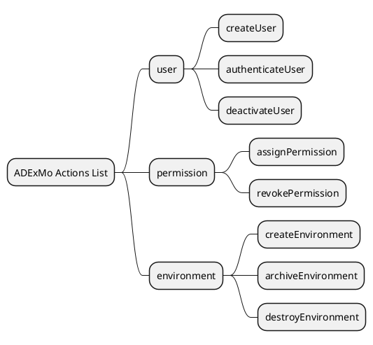

# Domains

## Purpose

In ADExMo, domains are the structural layer of the Actions List.

They organize actions by responsibility and prevent the Actions List from becoming a flat, ambiguous, and difficult-to-maintain catalog.

A domain answers one question:

> Which area of responsibility does this action belong to?

Domains do not describe how the system is implemented.

They describe how the application behavior is organized.

---

## Definition

A domain is a logical group of actions that represents a specific area of responsibility of the system.

Examples:

```text
user
order
invoice
payment
environment
permission
notification
```

Each domain contains actions that belong to the same business or operational responsibility.

Example:

```text
user
├── createUser
├── authenticateUser
└── deactivateUser

order
├── createOrder
├── processOrder
└── cancelOrder
```

---

## Core Principle

> The Actions List is not a flat list. It is structured by domains.

This means that actions must not be defined directly as an ungrouped list.

Invalid structure:

```text
createUser
processOrder
generateInvoice
assignPermission
createEnvironment
```

Valid structure:

```text
user
├── createUser

environment
├── createEnvironment

permission
├── assignPermission

order
├── processOrder

invoice
├── generateInvoice
```

---

## Why Domains Are Required

Without domains, the Actions List becomes harder to read and maintain as the application grows.

A flat list creates several problems:

- unclear responsibility boundaries
- duplicated actions with similar names
- inconsistent naming
- difficult navigation
- weak ownership between teams
- confusion between business concepts and technical implementation

Domains solve these problems by introducing a stable organizational layer.

---

## What a Domain Represents

A valid domain represents:

- a responsibility of the system
- a functional area
- a business capability
- an operational boundary
- a stable grouping of related actions

A valid domain can usually be explained in one sentence.

Example:

```text
user
Manages identity, authentication, and user lifecycle.

permission
Manages authorization and access control.

environment
Manages the lifecycle of application environments.
```

---

## What a Domain Must Not Represent

A domain must not represent technical implementation details.

Invalid domains:

```text
controller
database
repository
api
service
model
job
queue
view
middleware
```

These names describe how the system is implemented, not what the system is responsible for.

ADExMo domains must remain independent from implementation technology.

---

## Domain Naming Rules

Domain names should be:

- short
- clear
- stable
- lowercase
- singular when possible
- understandable without technical context

Recommended style:

```text
user
order
invoice
payment
permission
environment
```

Avoid vague names:

```text
management
data
misc
common
handler
process
```

A vague domain is usually a sign that the responsibility boundary is not clear yet.

---

## Domain Description

Each domain should have a short description.

The description must explain the responsibility of the domain, not its implementation.

Example:

```markdown
### user

Manages identity, authentication, and user lifecycle.
```

Bad example:

```markdown
### user

Contains user controllers, user database tables, and user services.
```

The second example is invalid because it exposes implementation details.

---

## Relationship Between Domains and Actions

Every action must belong to exactly one domain.

This rule is important.

If an action seems to belong to multiple domains, one of these problems probably exists:

- the action is doing too much
- the domain boundaries are unclear
- the action name is too generic
- the business responsibility has not been analyzed properly

Example of a problematic action:

```text
userPermission:updateUserAndAssignPermission
```

This action likely combines two responsibilities.

Better structure:

```text
user
├── updateUser

permission
├── assignPermission
```

---

## Domain First, Action Second

Domains must be defined before actions.

The correct sequence is:

```text
1. identify system responsibilities
2. define domains
3. define actions inside each domain
4. validate each action
5. define action contracts
```

The wrong sequence is:

```text
1. list random actions
2. group them later
```

That approach usually produces weak domains and inconsistent action names.

---

## Domain and Action Naming

A domain groups responsibility.

An action defines executable behavior.

Together, they form a clear action identifier.

Recommended format:

```text
<domain>:<action>
```

Examples:

```text
user:create
user:authenticate
order:process
invoice:generate
permission:assign
environment:create
```

The domain provides context.

The action provides behavior.

---

## Domain-Action MindMap

A Domain-Action MindMap can be used as a structural overview of the Actions List.

Its role is to show:

- domains
- actions inside each domain
- the general structure of application behavior

It must not replace the formal Actions List.

The Actions List remains the official contract.

The MindMap is only a navigation and validation view.

Example:

```text
ADExMo Actions List
├── user
│   ├── createUser
│   ├── authenticateUser
│   └── deactivateUser
├── permission
│   ├── assignPermission
│   └── revokePermission
└── environment
    ├── createEnvironment
    ├── archiveEnvironment
    └── destroyEnvironment
```

---

## PlantUML MindMap Example

A simple PlantUML MindMap can be used to document the structure.



This diagram is useful for orientation, but it does not contain the complete action definitions.

The full action definitions must remain in the Actions List.

---

## Domain Validation Checklist

Before accepting a domain, verify the following points.

### 1. Responsibility

Does the domain represent a real responsibility of the system?

Valid:

```text
invoice
```

Invalid:

```text
repository
```

---

### 2. Stability

Is the domain likely to remain stable even if implementation changes?

Valid:

```text
payment
```

Invalid:

```text
stripe
```

The payment provider may change.

The payment responsibility remains.

---

### 3. Non-technical Naming

Does the domain avoid technical layer names?

Valid:

```text
notification
```

Invalid:

```text
queue
```

---

### 4. Clear Boundary

Can the domain be clearly distinguished from other domains?

If two domains overlap too much, they should be revised.

Example:

```text
account
user
profile
```

These may be valid in some systems, but they must be clearly defined.

Without clear definitions, they become ambiguous.

---

### 5. Action Ownership

Can every action inside the domain clearly belong to that domain?

If not, either the action or the domain is wrong.

---

## Common Mistakes

### Mistake 1: Using technical layers as domains

Invalid:

```text
api
controller
service
database
```

These are implementation details.

---

### Mistake 2: Creating generic domains

Invalid:

```text
management
common
misc
operations
```

These domains hide responsibility instead of clarifying it.

---

### Mistake 3: Creating domains from database tables

A database table is not automatically a domain.

Example:

```text
users
roles
permissions
```

These may exist as tables, but ADExMo domains must be based on responsibilities.

A better structure could be:

```text
identity
permission
```

or:

```text
user
permission
```

depending on the application context.

---

### Mistake 4: Creating too many small domains

Too many domains can fragment the Actions List.

Example:

```text
email
sms
push
```

A better domain may be:

```text
notification
├── sendEmailNotification
├── sendSmsNotification
└── sendPushNotification
```

Unless email, SMS, and push represent truly separate responsibilities, they should not become separate domains.

---

### Mistake 5: Mixing business domains and technical adapters

Invalid:

```text
user
order
http
cli
queue
```

HTTP, CLI, and queue are adapters, not domains.

They describe how actions are invoked, not what the system does.

---

## Domain Granularity

Domain granularity depends on the size and complexity of the application.

A small application may use few domains:

```text
user
order
payment
```

A larger application may need more precise domains:

```text
identity
subscription
billing
invoice
payment
notification
reporting
```

The goal is not to create many domains.

The goal is to create clear responsibility boundaries.

---

## Domains and Team Collaboration

Domains help teams work with clearer boundaries.

A domain can support:

- responsibility assignment
- documentation ownership
- implementation planning
- API mapping
- UI integration
- test planning

However, a domain is not necessarily the same thing as a team.

A team may own multiple domains.

A domain may involve multiple teams.

The domain remains a logical responsibility boundary, not an organizational chart.

---

## Domains and Versioning

Changes to domains can affect the Actions List contract.

Examples of non-breaking changes:

- adding a new domain
- adding a new action inside an existing domain
- clarifying a domain description without changing behavior

Examples of potentially breaking changes:

- moving an action from one domain to another
- renaming a domain
- merging domains
- splitting a domain
- changing action identifiers

Because action identifiers often use the `<domain>:<action>` format, domain names must be treated carefully.

---

## Example Domain Section

A domain section in an Actions List may look like this:

```markdown
## Domains

### user

Manages identity, authentication, and user lifecycle.

Actions:

- user:create
- user:authenticate
- user:deactivate

### permission

Manages authorization and access control.

Actions:

- permission:assign
- permission:revoke
- permission:listByUser

### environment

Manages the lifecycle of application environments.

Actions:

- environment:create
- environment:archive
- environment:destroy
```

---

## Recommended Actions List Structure

A complete Actions List should usually follow this structure:

```text
1. Purpose
2. Structural Overview
3. Domain-Action MindMap
4. Domains
5. Action Definitions
6. Versioning Rules
7. Breaking Change Rules
```

Domains are therefore introduced before detailed action definitions.

This keeps the Actions List readable and navigable.

---

## Summary

Domains are the structural layer of ADExMo.

They organize actions by responsibility and make the Actions List scalable.

A valid domain:

- represents a real responsibility
- avoids implementation details
- contains related actions
- is stable over time
- improves readability and navigation
- supports team collaboration

Final rule:

> If the domain describes technology, it is probably wrong.

A domain must describe responsibility.
